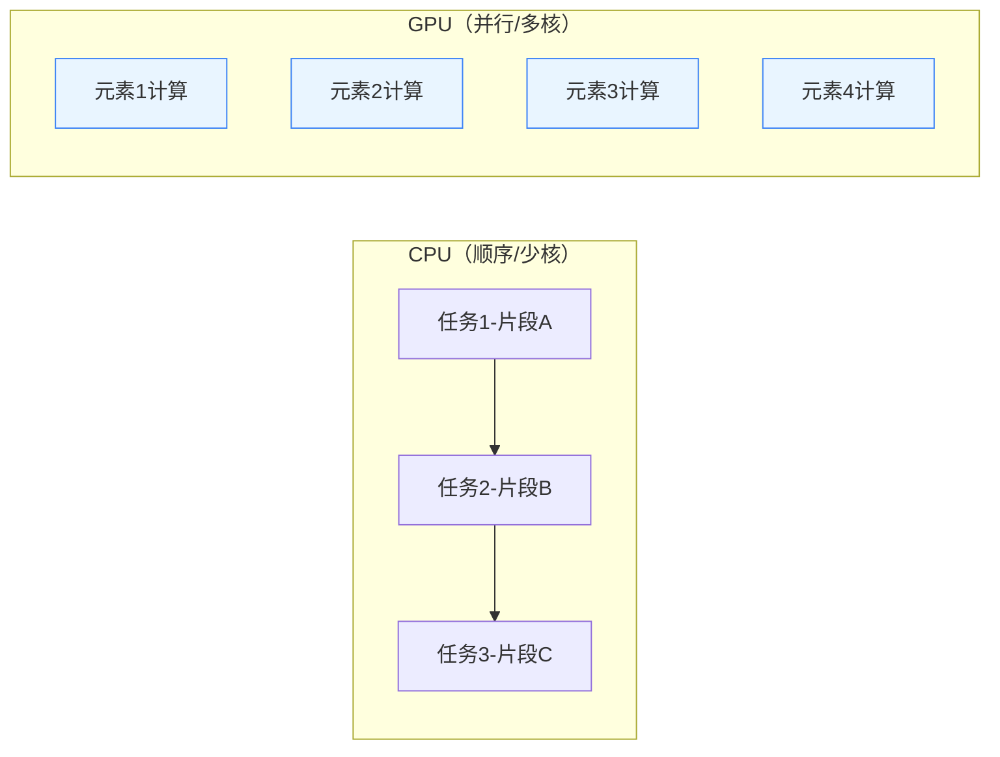

# CPU/GPU 与大模型训练


# AI 教程: CPU/GPU 与大模型训练

> 这是一份高浓缩资料：结构清晰、要点到位，涵盖 CPU/GPU 基础、张量与数值精度、CUDA 与 PyTorch 实操、硬件选型、常见问答与排错清单。

---

## 0. 速览（30 秒）

- **CPU vs GPU**：CPU 擅长**通用/顺序**处理；GPU 擅长**大规模并行**（矩阵/向量）。
- **大模型必备 GPU**：训练/推理核心是矩阵乘和并行化，GPU 的高并发 + 高带宽显存恰好匹配。
- **张量与精度**：一切数据 → 张量；精度（FP16/FP8）与**量化**（INT8/INT4）是速度/显存与效果之间的权衡。
- **PyTorch 上卡口诀**：`device = "cuda" if ...; model.to(device); data.to(device)`
- **选卡看显存**：先显存，再带宽/算力；生产尽量用**满血高质量模型**或云端托管 API。

---

## 1. CPU 与 GPU：差异、场景与类比

### 1.1 一句话对比

| 维度     | CPU                      | GPU                              |
| -------- | ------------------------ | -------------------------------- |
| 架构     | 少核、复杂控制流         | 海量小核、SIMT 并行              |
| 擅长     | 分支/系统任务/小规模计算 | 矩阵乘、卷积、注意力、图形渲染   |
| 任务模型 | 时间片轮转、低延迟切换   | 批处理&吞吐导向                  |
| 典型用法 | 业务逻辑、调度、I/O      | 训练/推理主算子（GEMM、Conv 等） |

### 1.2 形象类比

- **CPU = 老专家**：思考缜密、一次做一件事快切换。
- **GPU = 千军万马**：海量士兵同时干活，适合“**同构小任务**”的并行。

### 1.3 可选 Mermaid 图（CPU 执行 vs GPU 并行）



---

## 2. 张量（Tensor）、精度与量化（配例子）

### 2.1 张量分级

- **0D**：标量 `3.14`
- **1D**：向量 `[1,2,3]`
- **2D**：矩阵（如 3×3 表）
- **3D+**：仍称张量（如 `batch×channel×height×width`）

**图像例子**：一批 32 张 224×224 RGB 图 → `32×3×224×224`（或 `N×H×W×C`，视框架而定）。

### 2.2 精度（Floating Point）

- **FP32/FP16/FP8…**：位宽越小 → **显存更省、吞吐更高**，但**数值稳定性/精度**下降。
- **累计误差类比**：按“1 元/秒” vs “1.1 元/秒”计薪，一个月累计差可能**上万**（长链路累积误差效应）。

### 2.3 量化（Integer）

- 把浮点权重/激活用更短整数（**INT8/INT4**）近似，**显存/带宽显著降低**。
- **代价**：生成质量/可对齐性下降（INT4 节省最多，质量下滑也更明显）。
- **面试提示**：回答量化时要**分开**谈权重量化、激活量化、PTQ（训练后量化）与 QAT（量化感知训练）。

---

## 3. CUDA 与生态

- **CUDA**（读“库达”）：NVIDIA 的并行计算平台/编程模型，深度学习框架通过 CUDA 使用 GPU。
- **框架**：PyTorch、TensorFlow、JAX、ONNX Runtime、TensorRT（推理优化）等。
- **设备抽象**：高层 API 屏蔽很多复杂度，**核心就是把数据与模型迁移到“cuda”设备**。

---

## 4. 训练工作流（从 0 到 1）

### 4.1 训练循环（通用版）

```mermaid
flowchart TD
  A[准备数据 X,y] --> B[建模 nn.Module]
  B --> C[选择设备 device]
  C --> D[迁移 model/data 到 device]
  D --> E[前向计算 y_hat = model(X)]
  E --> F[计算损失 Loss(y_hat, y)]
  F --> G[反传 loss.backward()]
  G --> H[优化器更新 optimizer.step()]
  H --> I{终止条件?}
  I -- 否 --> D
  I -- 是 --> J[评估与保存]
```

### 4.2 PyTorch 最小闭环（可直接粘贴）

```python
import torch
import torch.nn as nn

# 1) 设备
device = "cuda" if torch.cuda.is_available() else "cpu"

# 2) 假数据：y = 2.0*x - 3.0 + noise
N = 100_000
X = torch.randn(N, 1)
y = 2.0 * X - 3.0 + 0.1 * torch.randn(N, 1)

X, y = X.to(device), y.to(device)

# 3) 模型
model = nn.Sequential(nn.Linear(1, 1)).to(device)

# 4) 优化与损失
opt = torch.optim.SGD(model.parameters(), lr=1e-2)
loss_fn = nn.MSELoss()

# 5) 训练
for epoch in range(200):
    opt.zero_grad()
    y_hat = model(X)
    loss = loss_fn(y_hat, y)
    loss.backward()
    opt.step()
    if (epoch+1) % 50 == 0:
        print(f"epoch {epoch+1}: loss={loss.item():.6f}")

# 6) 保存
torch.save(model.state_dict(), "linear.pth")
```

> 口令：**模型与数据都要 `.to(device)`**；多卡并行看 `DistributedDataParallel`（生产优先）或 `DataParallel`（入门/演示）。

---

## 5. 硬件选型与显存感知

> 面试时“会估”很加分：先问**模型大小/精度/序列长度/并发**，再给建议。

### 5.1 粗略显存直觉（仅作量级参考）

| 模型规模 |           FP16 估计 |     INT8 估计 |     INT4 估计 | 备注                           |
| -------- | ------------------: | ------------: | ------------: | ------------------------------ |
| 7B       |           ~14–16 GB |      ~8–10 GB |       ~5–6 GB | 仅权重，不含 KV Cache/激活峰值 |
| 13B      |           ~26–28 GB |     ~14–16 GB |      ~8–10 GB | 实占依实现差异很大             |
| 70B      | 需要多卡/数据中心卡 | 量化+牺牲并发 | 量化+更强约束 | 常见为 A100/H100 或多卡集群    |

> **KV Cache/序列长度/批量并发** 会显著抬高占用：面试时要主动声明这一点。

### 5.2 常见卡与场景（示意）

| 场景               | 建议                                             |
| ------------------ | ------------------------------------------------ |
| 学习/小实验        | RTX 3090/4090（24GB），Colab/云上临时卡          |
| 7B–13B 推理/轻微调 | 24GB 卡 + 量化/LoRA；或小型云实例                |
| 30B+ / 70B+        | A100/H100 等数据中心卡或多卡；生产优先云托管 API |

> 原则：**生产尽量用满血高质量模型（云 API/托管服务）**，避免把强量化小模型硬塞到本地承担严肃质量目标。

---

## 6. 面试常见问答（可背要点）

1. **为什么 GPU 比 CPU 适合训练？**
   因为训练/推理核心是矩阵/向量批运算（GEMM/Attention），GPU 的海量并行核与高带宽显存能显著提升吞吐与能效。

2. **张量是什么？**
   多维数组的统称：标量 → 向量 → 矩阵 → 更高维（图像/语音/文本 embedding 最终都映射为张量）。

3. **FP16 与 INT8 的差别？**
   FP16 属于浮点降精；INT8 是整数量化。INT8 更省资源但更容易带来可感知质量下降；FP16 在速度/效果间更平衡。

4. **PTQ vs QAT？**
   PTQ：训练后量化，成本低；QAT：在训练中模拟量化，效果更好、成本更高。

5. **如何让代码“用上 GPU”？**
   检测设备、`model.to(device)`、`tensor.to(device)`；多卡优先 `DistributedDataParallel`；警惕**显存转移/类型不一致**导致的隐性回退。

6. **为什么评估要用测试集？**
   防止过拟合/数据泄漏；训练集表现不代表泛化能力。

7. **量化后效果下降如何缓解？**
   QAT、混合精度（关键层高精度）、校准高代表性数据、感知度高任务（长文案/代码）谨慎使用低位量化。

8. **本地部署 vs 云端 API？**
   本地可控性与成本可见，但硬件/维护重；云端**弹性/稳定/上线快**且能用到**更强模型**，生产优先。

9. **Mac（Apple Silicon）如何加速？**
   用 `mps` 后端（Metal）；生态/性能与 CUDA 有差异，复杂训练建议仍用 NVIDIA GPU 或云端。

10. **显存不够还能做什么？**
    量化、LoRA/QLoRA、梯度检查点、张量并行/流水线并行、减少序列长度/批量/并发、KV Cache 复用与卸载策略。

---

## 7. 常见排错清单（Checklist）

- **设备不一致**：确认 `model`、`inputs`、`labels` **都在同一 device**。
- **精度/类型错配**：`float16` vs `float32`、`long` vs `float`；启用 AMP（自动混合精度）时关注溢出/NaN。
- **显存 OOM**：减 batch/seq len、开梯度检查点、量化、分布式并行切片。
- **数据瓶颈**：DataLoader `num_workers/pin_memory`、预处理并行、I/O 排队。
- **多卡“只用一张”**：是否真的走了 `DDP`，环境变量、初始化方法、NCCL 配置是否正确。
- **评估偏差**：确保严格的训练/验证/测试划分，避免数据泄漏。

---

## 8. 术语小词典（面试快速解释）

- **Tensor**：多维数组；0D 标量、1D 向量、2D 矩阵、3D+ 张量。
- **FP16/FP8**：浮点降精，速度快/显存省；稳定性需关注。
- **INT8/INT4**：整数量化，更省但质量更敏感。
- **PTQ/QAT**：训练后量化 / 量化感知训练。
- **AMP**：自动混合精度（如 PyTorch autocast + GradScaler）。
- **KV Cache**：注意力缓存，加速生成但占显存。
- **DDP**：分布式数据并行（生产首选）。
- **TensorRT**：NVIDIA 推理优化工具链。
- **LoRA/QLoRA**：低秩适配（/结合量化），小显存微调利器。

---

## 9. 附录：简明示例与片段

### 9.1 张量形状与上卡

```python
x = torch.randn(32, 3, 224, 224)     # NCHW
device = "cuda" if torch.cuda.is_available() else "cpu"
x = x.to(device)
```

### 9.2 混合精度训练骨架

```python
scaler = torch.cuda.amp.GradScaler()
for step, (x, y) in enumerate(loader):
    x, y = x.to(device), y.to(device)
    optimizer.zero_grad()
    with torch.cuda.amp.autocast():
        y_hat = model(x)
        loss = loss_fn(y_hat, y)
    scaler.scale(loss).backward()
    scaler.step(optimizer)
    scaler.update()
```

### 9.3 DataParallel/DDP 提示

- **演示**可用 `nn.DataParallel(model)`；
- **生产**优先 `torch.distributed` + `DistributedDataParallel`，启动脚本与环境变量（`MASTER_ADDR/PORT`、`WORLD_SIZE` 等）务必正确。

---

## 10. 一页总结（可口号式记忆）

- **CPU 顺序通用，GPU 并行矩阵**。
- **把模型与数据都 `.to("cuda")`**。
- **精度越低越快越省，但更"糙"**（FP16/FP8/INT8/INT4）。
- **量化与蒸馏不是一回事**：位宽压缩 vs 老带新。
- **估显存先抓权重，再想 KV/并发/长度**。
- **生产优先满血强模型（云端）**；本地量化适合学习/原型。
- **评估看测试集，不看训练集**。
- **多卡优先 DDP**，留心通信与初始化。

---

## 📚 延伸阅读

### 🔗 AI 大模型系统教程系列

1. **[AI 大模型完全指南]()** - 从零基础到 Token 与向量的深度解析
2. **[Transformer 架构深度解析]()** - 注意力机制与 AI 大模型的核心技术
3. **[Prompt Engineering 完全指南]()** - 从提示工程到上下文工程的实战教程
4. **[本文] GPU 加速训练实战指南** - 从 CPU 架构到 CUDA 编程的完整教程
5. **[AI 专业名词解释表]()** - 270+术语完全指南与 AI 技术体系词典

### 🎯 实战建议

- **理论先行**：如果对 Token、向量、Transformer 等概念不熟悉，建议先阅读前三篇基础教程
- **实践结合**：本文为实战指南，建议结合实际项目进行 GPU 训练实践
- **术语查阅**：开发过程中遇到专业术语时，可随时查阅 AI 专业名词解释表
- **硬件选型**：根据项目需求和预算，参考本文硬件选型建议进行配置

---

