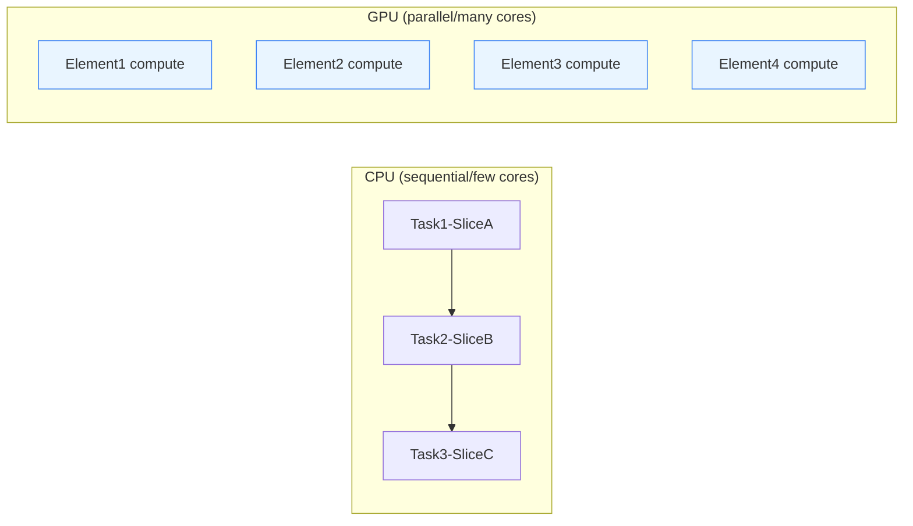

# CPU, GPU, and Training Large Language Models


# AI Tutorial: CPU/GPU and Large Model Training

> This is a highly condensed reference: clearly structured, right to the point — covering CPU/GPU fundamentals, tensors and numerical precision, CUDA and PyTorch in practice, hardware selection, common interview questions, and a debugging checklist.

---

## 0. Quick Overview (30 Seconds)

- **CPU vs GPU**: CPUs excel at **general-purpose/sequential** work; GPUs excel at **massive parallelism** (matrices/vectors).
- **Large models need GPUs**: training/inference is fundamentally matrix multiplication and parallelization — exactly what a GPU's high concurrency + high-bandwidth memory deliver.
- **Tensors and precision**: all data becomes tensors; precision (FP16/FP8) and **quantization** (INT8/INT4) trade speed/VRAM against quality.
- **The PyTorch GPU mantra**: `device = "cuda" if ...; model.to(device); data.to(device)`
- **Pick a GPU by VRAM first**: VRAM first, then bandwidth/compute; for production, prefer **full-strength high-quality models** or cloud-hosted APIs.

---

## 1. CPU vs GPU: Differences, Workloads, and Analogies

### 1.1 The One-Line Comparison

| Dimension | CPU | GPU |
| --------- | --- | --- |
| Architecture | Few cores, complex control flow | Massive small cores, SIMT parallelism |
| Excels at | Branching/system tasks/small-scale compute | Matrix multiplication, convolution, attention, graphics rendering |
| Task model | Time-sliced, low-latency switching | Batch- and throughput-oriented |
| Typical use | Business logic, scheduling, I/O | Main training/inference operators (GEMM, Conv, etc.) |

### 1.2 An Intuitive Analogy

- **CPU = a veteran expert**: meticulous thinking, does one thing at a time with fast switching.
- **GPU = a massive army**: hordes of soldiers working simultaneously — built for parallel **homogeneous small tasks**.

### 1.3 Optional Mermaid Diagram (CPU Execution vs GPU Parallelism)



---

## 2. Tensors, Precision, and Quantization (with Examples)

### 2.1 Tensor Hierarchy

- **0D**: scalar `3.14`
- **1D**: vector `[1,2,3]`
- **2D**: matrix (e.g. a 3×3 table)
- **3D+**: still called a tensor (e.g. `batch×channel×height×width`)

**Image example**: a batch of 32 224×224 RGB images → `32×3×224×224` (or `N×H×W×C`, depending on the framework).

### 2.2 Precision (Floating Point)

- **FP32/FP16/FP8…**: narrower bit width → **less VRAM, higher throughput**, but worse **numerical stability/precision**.
- **Cumulative-error analogy**: getting paid "1 unit/second" vs "1.1 units/second" — over a month the gap can reach **tens of thousands** (error accumulates over long chains of computation).

### 2.3 Quantization (Integer)

- Approximate floating-point weights/activations with shorter integers (**INT8/INT4**) — **VRAM/bandwidth drop significantly**.
- **The cost**: generation quality/alignment degrades (INT4 saves the most but loses the most quality).
- **Interview tip**: when asked about quantization, discuss **separately** weight quantization, activation quantization, PTQ (post-training quantization), and QAT (quantization-aware training).

---

## 3. CUDA and the Ecosystem

- **CUDA**: NVIDIA's parallel computing platform and programming model; deep learning frameworks reach the GPU through CUDA.
- **Frameworks**: PyTorch, TensorFlow, JAX, ONNX Runtime, TensorRT (inference optimization), and others.
- **Device abstraction**: high-level APIs hide most of the complexity — **the essence is moving your data and model onto the "cuda" device**.

---

## 4. The Training Workflow (From 0 to 1)

### 4.1 The Training Loop (General Form)

```mermaid
flowchart TD
  A[Prepare data X,y] --> B[Define model nn.Module]
  B --> C[Choose device]
  C --> D[Move model/data to device]
  D --> E[Forward pass y_hat = model(X)]
  E --> F[Compute loss Loss(y_hat, y)]
  F --> G[Backprop loss.backward()]
  G --> H[Optimizer update optimizer.step()]
  H --> I{Stop condition?}
  I -- No --> D
  I -- Yes --> J[Evaluate and save]
```

### 4.2 Minimal PyTorch Loop (Paste-Ready)

```python
import torch
import torch.nn as nn

# 1) Device
device = "cuda" if torch.cuda.is_available() else "cpu"

# 2) Synthetic data: y = 2.0*x - 3.0 + noise
N = 100_000
X = torch.randn(N, 1)
y = 2.0 * X - 3.0 + 0.1 * torch.randn(N, 1)

X, y = X.to(device), y.to(device)

# 3) Model
model = nn.Sequential(nn.Linear(1, 1)).to(device)

# 4) Optimizer and loss
opt = torch.optim.SGD(model.parameters(), lr=1e-2)
loss_fn = nn.MSELoss()

# 5) Training
for epoch in range(200):
    opt.zero_grad()
    y_hat = model(X)
    loss = loss_fn(y_hat, y)
    loss.backward()
    opt.step()
    if (epoch+1) % 50 == 0:
        print(f"epoch {epoch+1}: loss={loss.item():.6f}")

# 6) Save
torch.save(model.state_dict(), "linear.pth")
```

> Mantra: **both the model and the data must be `.to(device)`-ed**. For multi-GPU parallelism see `DistributedDataParallel` (production first choice) or `DataParallel` (beginner/demo).

---

## 5. Hardware Selection and VRAM Awareness

> In interviews, "being able to estimate" earns points: first ask about **model size/precision/sequence length/concurrency**, then advise.

### 5.1 Rough VRAM Intuition (Order-of-Magnitude Only)

| Model size | FP16 estimate | INT8 estimate | INT4 estimate | Notes |
| ---------- | ------------- | ------------- | ------------- | ----- |
| 7B | ~14–16 GB | ~8–10 GB | ~5–6 GB | Weights only, excluding KV cache/activation peaks |
| 13B | ~26–28 GB | ~14–16 GB | ~8–10 GB | Actual usage varies widely by implementation |
| 70B | Multi-GPU/data-center cards needed | Quantized + sacrificed concurrency | Quantized + tighter constraints | Typically A100/H100 or multi-GPU clusters |

> **KV cache/sequence length/batch concurrency** can push usage way up: call this out proactively in interviews.

### 5.2 Common Cards and Scenarios (Illustrative)

| Scenario | Recommendation |
| -------- | -------------- |
| Learning / small experiments | RTX 3090/4090 (24GB), Colab/cloud spot cards |
| 7B–13B inference / light fine-tuning | 24GB card + quantization/LoRA; or a small cloud instance |
| 30B+ / 70B+ | A100/H100-class data-center cards or multi-GPU; production prefers cloud-hosted APIs |

> Principle: **in production, use full-strength high-quality models (cloud APIs/managed services)** — don't force a heavily quantized small model onto local hardware and expect serious quality.

---

## 6. Common Interview Q&A (Memorizable Points)

1. **Why are GPUs better than CPUs for training?**
   Because training/inference cores are batched matrix/vector operations (GEMM/Attention); a GPU's massive parallel cores and high-bandwidth memory dramatically improve throughput and energy efficiency.

2. **What is a tensor?**
   The umbrella term for multi-dimensional arrays: scalar → vector → matrix → higher dimensions (images/speech/text embeddings all end up as tensors).

3. **What's the difference between FP16 and INT8?**
   FP16 is reduced-precision floating point; INT8 is integer quantization. INT8 saves more resources but more easily causes perceptible quality loss; FP16 balances speed and quality better.

4. **PTQ vs QAT?**
   PTQ: post-training quantization, low cost. QAT: simulates quantization during training — better results, higher cost.

5. **How do you make code "use the GPU"?**
   Detect the device, `model.to(device)`, `tensor.to(device)`; prefer `DistributedDataParallel` for multi-GPU; watch for **silent fallbacks caused by device/dtype mismatches**.

6. **Why evaluate on a test set?**
   To prevent overfitting/data leakage; training-set performance says nothing about generalization.

7. **How to mitigate quality loss after quantization?**
   QAT, mixed precision (high precision for critical layers), calibration on highly representative data, and careful use of low-bit quantization for sensitivity-heavy tasks (long-form writing/code).

8. **Local deployment vs cloud API?**
   Local gives control and visible costs but heavy hardware/maintenance; the cloud is **elastic/stable/fast to launch** and gives access to **stronger models** — preferred for production.

9. **How do you accelerate on Mac (Apple Silicon)?**
   Use the `mps` backend (Metal); the ecosystem/performance differ from CUDA — for serious training, still use NVIDIA GPUs or the cloud.

10. **What else can you do when VRAM runs out?**
    Quantization, LoRA/QLoRA, gradient checkpointing, tensor/pipeline parallelism, shorter sequences/smaller batches/less concurrency, KV cache reuse and offloading strategies.

---

## 7. Common Debugging Checklist

- **Device mismatch**: confirm `model`, `inputs`, and `labels` are **all on the same device**.
- **Precision/dtype mismatch**: `float16` vs `float32`, `long` vs `float`; with AMP (automatic mixed precision) watch for overflow/NaN.
- **VRAM OOM**: reduce batch/seq len, enable gradient checkpointing, quantize, shard with distributed parallelism.
- **Data bottleneck**: DataLoader `num_workers/pin_memory`, parallel preprocessing, I/O queuing.
- **Multi-GPU "only one card is used"**: is it really running under `DDP`; are environment variables, the init method, and NCCL config correct?
- **Evaluation bias**: enforce strict train/validation/test splits to avoid data leakage.

---

## 8. Mini Glossary (Quick Interview Definitions)

- **Tensor**: multi-dimensional array; 0D scalar, 1D vector, 2D matrix, 3D+ tensor.
- **FP16/FP8**: reduced-precision floats — faster/less VRAM; watch stability.
- **INT8/INT4**: integer quantization — bigger savings, more quality-sensitive.
- **PTQ/QAT**: post-training quantization / quantization-aware training.
- **AMP**: automatic mixed precision (e.g. PyTorch autocast + GradScaler).
- **KV Cache**: attention cache — speeds up generation but consumes VRAM.
- **DDP**: DistributedDataParallel (production first choice).
- **TensorRT**: NVIDIA's inference optimization toolchain.
- **LoRA/QLoRA**: low-rank adaptation (/ combined with quantization) — the small-VRAM fine-tuning weapon.

---

## 9. Appendix: Concise Examples and Snippets

### 9.1 Tensor Shapes and Moving to GPU

```python
x = torch.randn(32, 3, 224, 224)     # NCHW
device = "cuda" if torch.cuda.is_available() else "cpu"
x = x.to(device)
```

### 9.2 Mixed-Precision Training Skeleton

```python
scaler = torch.cuda.amp.GradScaler()
for step, (x, y) in enumerate(loader):
    x, y = x.to(device), y.to(device)
    optimizer.zero_grad()
    with torch.cuda.amp.autocast():
        y_hat = model(x)
        loss = loss_fn(y_hat, y)
    scaler.scale(loss).backward()
    scaler.step(optimizer)
    scaler.update()
```

### 9.3 DataParallel/DDP Tips

- For **demos**, `nn.DataParallel(model)` works;
- For **production**, prefer `torch.distributed` + `DistributedDataParallel`; make sure the launch script and environment variables (`MASTER_ADDR/PORT`, `WORLD_SIZE`, etc.) are correct.

---

## 10. One-Page Summary (Slogan-Style Memory Hooks)

- **CPUs are sequential and general-purpose; GPUs are parallel matrix machines.**
- **Move both model and data `.to("cuda")`.**
- **Lower precision = faster and cheaper, but rougher** (FP16/FP8/INT8/INT4).
- **Quantization and distillation are not the same thing**: bit-width compression vs teacher-trains-student.
- **Estimate VRAM starting from the weights, then think about KV/concurrency/length.**
- **Production prefers full-strength models (cloud)**; local quantization is for learning/prototyping.
- **Evaluate on the test set, not the training set.**
- **Prefer DDP for multi-GPU**, and mind communication and initialization.

---

## 📚 Further Reading

### 🔗 AI LLM Systematic Tutorials Series

1. **[A Complete Guide to AI LLMs]()** — tokens and vectors explained in depth, from the ground up
2. **[Transformer Architecture Deep Dive]()** — the attention mechanism and the core technology behind LLMs
3. **[Prompt Engineering Complete Guide]()** — a hands-on guide from prompt engineering to context engineering
4. **[This post] GPU-Accelerated Training Guide** — the complete guide from CPU architecture to CUDA programming
5. **[AI Technical Glossary]()** — 270+ terms and a dictionary of the AI technology landscape

### 🎯 Practical Advice

- **Theory first**: if tokens, vectors, or Transformers are unfamiliar, read the first three foundational tutorials first
- **Pair with practice**: this is a hands-on guide — apply it to a real project doing GPU training
- **Look up terms**: when you hit a technical term during development, check the AI glossary anytime
- **Hardware selection**: configure per your project needs and budget, referencing the hardware advice here

---

