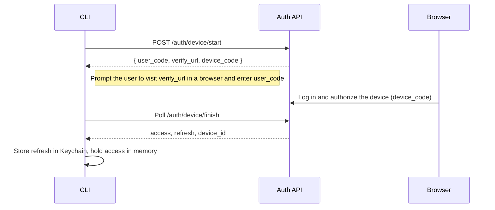
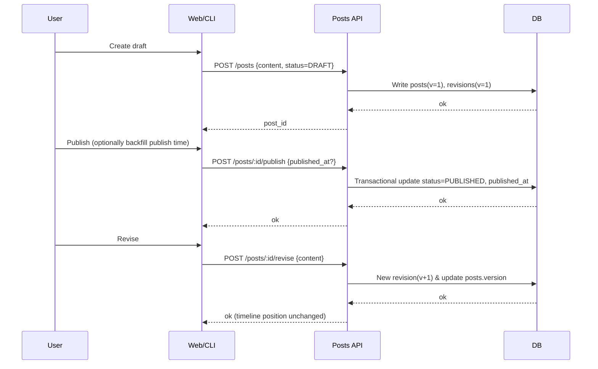

# Timeline Recorder: Technical Architecture from MVP to Scale


# Timeline Recorder: Requirements & Technical Architecture (MVP → Scalable)

> Target: personal/small-team local or centralized deployment; web + CLI + TUI; text/images/linked audio and video; draft/publish; users may edit only their own content; everyone's content viewable, with mute support; no built-in transcription; decentralization as an optional later capability.

---

## 0. Background and Goals

- **Goal**: build a "local-first, centrally deployable" timeline recorder that guarantees data sovereignty and simple deployment; an extremely fast capture experience without sacrificing a clean timeline.
- **Core values**:

  1. A stable **draft → publish** timeline (`published_at` as the anchor; revisions don't move the anchor).
  2. **Centralized permissions** (not decentralized for the MVP): simpler permission adjudication, no client-side forking conflicts.
  3. **Multiple media types**: text, images, external links (Bilibili/YouTube) embedded via privacy mode; no local storage consumed; no built-in speech transcription.
  4. **Multiple clients**: web, CLI, and TUI sharing one consistent workflow.

---

## 1. Constraints and Non-Goals

- **Non-goals (not in the MVP)**:

  - Decentralization/federated sync (Nostr/ActivityPub);
  - Built-in audio/video transcription;
  - Complex social graphs (following, recommendations, DMs, etc.).

- **Constraints**:

  - Single instance (local or intranet) as the **single source of truth, SoT**;
  - HTTPS mandatory;
  - Authors-only writes; visibility controlled by `private | group | public`; authors can be muted.

---

## 2. User Stories (by priority)

1. As a user, I can create a draft with images or a linked video attached, and publish it later.
2. As a user, I can publish in one click / backfill the publish time, and the timeline position stays stable.
3. As a user, I can revise content after publishing (version +1) without the timeline jumping.
4. As a user, I can browse others' published content, and mute anyone I don't want to see with one click.
5. As a user, I can see all authors on this instance on a user directory page.
6. As a user, I can quickly capture, publish, search, and view history versions from the CLI/TUI.
7. As an admin, I can create users/groups, set content visibility boundaries, and audit and export.
8. As a power user, I paste a Bilibili/YouTube link and the system shows a thumbnail or plays it in privacy mode, without exposing my IP (proxy/thumbnail cache).

---

## 3. Feature List (MVP → Extensions)

### 3.1 Core Features (MVP)

- Posts: draft/publish/revise/backfill time; external link embedding (domain whitelist + oEmbed/OG metadata + thumbnail proxy cache + privacy mode).
- Media: image upload (local object storage/directory + SHA256 verification).
- Search: SQLite FTS5 (full-text search over `title/content`).
- Permissions: author-only writes; `private | group | public`; group members can read group content; mute authors (local preference).
- Accounts: username/password login; roles `user/mod/admin`.
- Auth: Access Token (15m) + Refresh (30d rotation) + PAT; device-code login (for browser-less scenarios).
- CLI/TUI: `tl new/edit/publish/revise/attach/search`; TUI list (drafts/published) + side preview.
- Export: authors or admins can export `Markdown + media + manifest.json`.

### 3.2 Advanced Features (public beta)

- Group management: group creation, member management, group visibility filters.
- Link privacy toggle: YouTube `youtube-nocookie.com`; unified CSP; offline degrades to thumbnail + text info.
- Auditing: operation logs for login/refresh/publish/delete; rate limits and alerts.

### 3.3 Optional Extensions (later)

- Decentralized sync (Nostr/ActivityPub) and relays;
- Semantic search (Meilisearch/Tantivy + vector retrieval);
- Desktop/Tauri one-click install;
- SSO (OIDC/SAML).

---

## 4. Domain Model and Data Structures (centralized)

**posts**

- `id (ULID)`, `author_id`, `status ENUM('DRAFT','PUBLISHED')`, `title`, `content_md`, `attachments JSONB`,
- `visibility ENUM('private','group','public')`, `group_id NULL`,
- `created_at`, `updated_at`, `published_at NULL`, `version INT`, `content_hash NULL`.

**post_revisions**

- `id (ULID)`, `post_id`, `version`, `content_md`, `attachments JSONB`, `created_at`.

**files**

- `id (ULID)`, `owner_id`, `post_id NULL`, `mime`, `size`, `sha256`, `local_path`, `created_at`.

**users**

- `id`, `username`, `display_name`, `password_hash`, `role ENUM('user','mod','admin')`, `is_active`, `created_at`.

**groups** / **group_members** (optional)

- `groups(id,name,created_by,created_at)`; `group_members(group_id,user_id,role)`.

**user_mutes**

- `user_id`, `muted_user_id`, `created_at`.

**sessions/refresh_tokens** (or a sessions table)

- `user_id`, `device_id`, `refresh_id`, `expires_at`, `revoked`.

**Index suggestions**

- `posts(status, published_at DESC)`; `post_revisions(post_id, version DESC)`;
- `posts(author_id, status)`; `posts(visibility, group_id, published_at DESC)`;
- FTS5 virtual table: `posts_fts(id, title, content_md)`.

---

## 5. Consistency and Ordering Rules

- **Single-instance serial writes**: server-side transactions + optimistic locking (`if_match_version`) or `SELECT ... FOR UPDATE`.
- **Sort anchor**: the timeline always sorts by `published_at DESC`; a revision only changes `version+1` and `updated_at`, never the anchor.
- **Backfilled publishing**: manually setting `published_at` is allowed but cannot be earlier than `created_at` (requires double confirmation).
- **Delete/hide**: Moderators/Admins can hide public content; deletions must retain audit records.

---

## 6. Security and Privacy

- **Transport**: HTTPS mandatory; certificate verification; CLI supports pinning self-signed certificate fingerprints TOFU (optional).
- **Auth**: PASETO/JWT; Access 15m; Refresh 30d rotation; PAT (CI/automation only).
- **Minimal claims**: Access contains only `sub/aud/exp/scope/role/device_id`.
- **External link safety**: domain whitelist (YouTube/Bilibili); iframe `sandbox`; unified CSP; oEmbed/OG fetching via server-side proxy with 24h cache; optional privacy mode (thumbnail + external redirect only).
- **Object storage**: upload MIME/size validation; downloads via permission checks or signed URLs; SHA256 deduplication.
- **Logging**: no plaintext tokens; only first 6 / last 4 characters; rate-limit login/refresh/device-code polling.

---

## 7. API (selection, REST)

**Auth**

- `POST /v1/auth/login_password` → `(access, refresh, device_id)`
- `POST /v1/auth/device/start` → `{ user_code, verify_url, device_code }`
- `POST /v1/auth/device/finish` → `(access, refresh, device_id)`
- `POST /v1/auth/refresh` / `POST /v1/auth/logout`
- `GET  /v1/auth/whoami`
- `POST /v1/tokens/pat` (create/revoke/list)

**Posts**

- `POST /v1/posts` (draft) / `GET /v1/posts?status=PUBLISHED&cursor=...&limit=...`
- `GET /v1/posts/:id` / `PATCH /v1/posts/:id` (author only & draft only)
- `POST /v1/posts/:id/publish {published_at?, visibility?, group_id?}`
- `POST /v1/posts/:id/revise` (post-publish revision, version+1)
- `GET /v1/posts/:id/revisions`

**Files / Embed**

- `POST /v1/files` (upload) / `GET /v1/files/:id` (authenticated)
- `POST /v1/embed/preview {url}` → oEmbed/OG metadata + embeddable snippet (trimmed per privacy mode)

**Users & Mutes**

- `GET /v1/users` (instance user directory)
- `POST /v1/users/:id/mute` / `DELETE .../mute`

---

## 8. CLI/TUI Interaction and Auth

- `timeline login [--device] --server <url>`: yields `(access, refresh)`; Refresh goes into the system Keychain (fallback: locally encrypted file).
- Auto-renewal: on 401 → `POST /auth/refresh` → replay the request.
- Multiple environments: `timeline context use dev|prod` stores different servers, certificate fingerprints, and tokens.
- Common commands:

  - `tl new/edit/publish/revise/attach/search/sync`
  - `tl whoami`, `tl logout`, `tl users`, `tl mute <user>`

---

## 9. Tech Stack and Delivery

- **Backend (Go)**: Gin/Fiber + sqlc/GORM; SQLite(FTS5)→Postgres; PASETO/JWT; zerolog; viper;
- **Frontend**: SvelteKit/Next.js + Tailwind;
- **CLI/TUI (Go)**: Cobra + Bubble Tea + Keyring;
- **Object storage**: local directory →MinIO;
- **Packaging and release**: goreleaser (multi-platform binaries, Homebrew/Scoop, Docker);
- **Deployment**: single-file binary or Docker Compose (with Caddy reverse proxy + automatic TLS).

---

## 10. Architecture Diagram

```mermaid
flowchart LR
  subgraph Client
    W[Web Frontend]
    C[CLI]
    T[TUI]
  end

  subgraph Server[Centralized Server]
    API[REST API (Gin/Fiber)]
    AUTH[Auth Service\nPASETO/JWT\nAccess/Refresh/PAT]
    EMBED[oEmbed/OG Fetcher\nThumbnail Proxy Cache]
    FILES[Object Storage\n(Local/MinIO)]
    SEARCH[Full-text Search\nSQLite FTS5]
    DB[(SQLite\n→ Postgres)]
    AUDIT[Audit/Logs]
  end

  W -->|HTTPS| API
  C -->|HTTPS + Bearer| API
  T -->|HTTPS + Bearer| API

  API --> AUTH
  API --> DB
  API --> SEARCH
  API --> FILES
  API --> EMBED
  API --> AUDIT

  classDef soft fill:#eef,stroke:#88a;
  classDef store fill:#ffe,stroke:#bb8;
  class DB,FILES,SEARCH store;
  class API,AUTH,EMBED,AUDIT soft;
```

---

## 11. Key Sequences (Device-Code Login & Publish Flow)

### 11.1 Device-Code Login



### 11.2 Draft → Publish → Revise



---

## 12. Interaction and Usability Details

- Publish dialog: visibility (private/group/public), publish time (now/specified), privacy mode (external links as thumbnail only).
- List page: drafts and published in separate columns; timeline cards show a `vN` revision badge; mute/unmute supported.
- Search: keywords (FTS5); filters: author, has-media, visibility, time range.
- Degraded experience: offline, external links show thumbnail + text; region-blocked shows an "external link unavailable" notice.

---

## 13. Acceptance Criteria (E2E)

1. Revisions don't change timeline order; backfilled publishes insert accurately into the historical segment;
2. Author-only writes, other users get 403; Moderators can hide public content;
3. After muting, both timeline and search filter that author; reversible from the user directory page;
4. In external-link privacy mode, no requests go to third parties; only cached thumbnails and an external redirect are shown;
5. CLI auto-renewal: transparent refresh after Access expires;
6. Data export includes Markdown, media, and manifest; after re-import, `published_at` and the version chain stay consistent;
7. HTTPS, rate limiting, and logging standards in place; tokens never hit the logs.

---

## 14. Milestones (suggested)

- **M1 (1–2 weeks)**: backend Posts/Files/Auth baseline + SQLite FTS5; minimal web UI; CLI `login/new/publish`;
- **M2 (1–2 weeks)**: revisions, backfill, mute, user directory, external-link privacy mode, export;
- **M3 (1–2 weeks)**: groups and visibility polish, auditing, install and release (goreleaser/Homebrew/Scoop/Docker);
- **M4 (optional)**: Meilisearch, Tauri packaging, SSO, experimental decentralized sync.

---

### Appendix: Release and Operations Suggestions

- Use `goreleaser` to ship multi-platform binaries + Homebrew/Scoop + Docker images;
- Caddy for the reverse proxy (automatic TLS);
- Backups: SQLite + WAL + litestream (or Postgres + wal-g);
- Monitoring: Prometheus + Grafana;
- Docs: a README with a 3-minute quickstart script (including device-code login, and conflict demos replaced by revisions).

