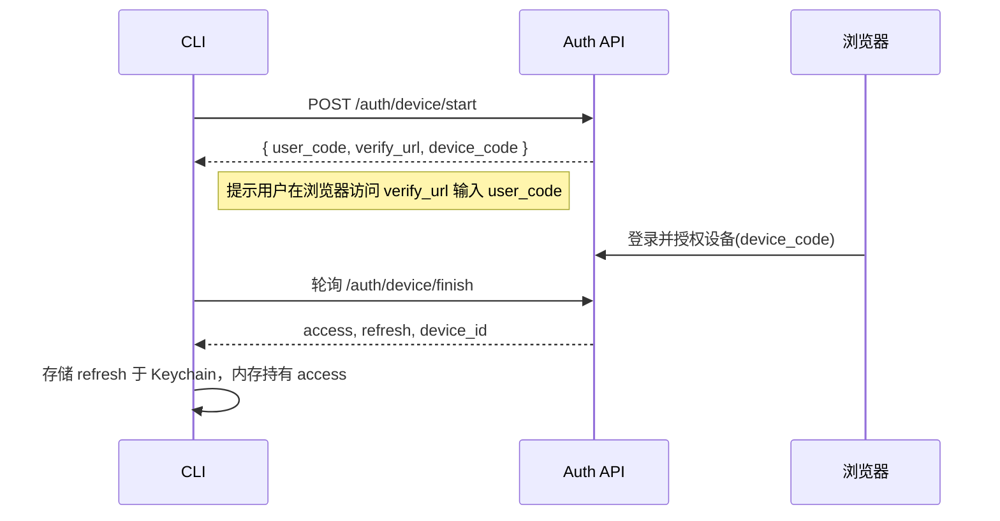
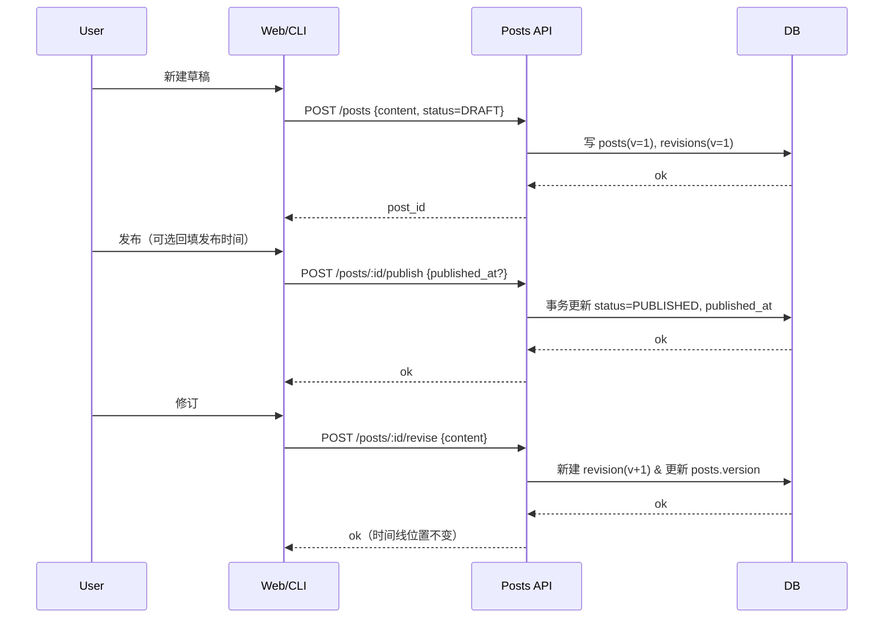

# 时间线记录器：从MVP到可扩展的技术架构设计


# 时间线记录器：需求清单 & 技术架构（MVP→ 可扩展）

> 面向：个人/小团队本地或集中式部署；网页 + CLI + TUI；支持文字/图片/外链音视频；草稿/发布；只允许编辑自己的内容；可查看所有人并支持“静音”；不内置转写；去中心化为后续可选能力。

---

## 0. 背景与目标

- **目标**：构建一款“本地优先、可集中部署”的时间线记录器，保证数据主权与简单部署；在不牺牲整洁时间线的前提下，提供极快的记录体验。
- **核心价值**：

  1. **草稿 → 发布**的稳定时间线（`published_at` 为锚点，修订不改锚点）。
  2. **集中式权限**（非去中心化的 MVP）：权限裁决更简单，客户端无分叉冲突。
  3. **多介质**：文字、图片、外链（Bilibili/YouTube）通过隐私模式嵌入；不占本地空间；不内置语音转写。
  4. **多终端**：网页、CLI、TUI 三端一致工作流。

---

## 1. 约束与非目标

- **非目标（MVP 不做）**：

  - 去中心化/联邦同步（Nostr/ActivityPub）；
  - 内置语音/视频转写；
  - 复杂社交关系（关注、推荐、私信等）。

- **约束**：

  - 单实例（本地或内网）作为**唯一真相源 SoT**；
  - HTTPS 强制；
  - 仅作者可写；可见性以 `private | group | public` 控制；可对作者“静音”。

---

## 2. 用户故事（按优先级）

1. 作为用户，我可以新建草稿，附带图片或外链视频，稍后发布。
2. 作为用户，我可以一键发布/回填发布时间，且时间线位置稳定。
3. 作为用户，我发布后还能修订内容（版本 +1），但时间线不跳动。
4. 作为用户，我能浏览他人已发布内容，若不想看某人，可一键静音。
5. 作为用户，我能在“用户目录页”看到本实例的所有作者。
6. 作为用户，我能从 CLI/TUI 快速记录、发布、搜索、查看历史版本。
7. 作为管理员，我能创建用户/组，设置内容可见性边界，审计与导出。
8. 作为高级用户，我粘贴 Bilibili/YouTube 链接，系统显示缩略图或隐私模式播放，不暴露我的 IP（代理/缩略图缓存）。

---

## 3. 功能清单（MVP → 扩展）

### 3.1 核心功能（MVP）

- 帖子：草稿/发布/修订/回填时间；外链嵌入（域名白名单 + oEmbed/OG 元数据 + 缩略图代理缓存 + 隐私模式）。
- 媒体：图片上传（本地对象存储/目录 + SHA256 校验）。
- 搜索：SQLite FTS5（`title/content` 全文检索）。
- 权限：作者自写；`private | group | public`；组成员可读组内容；静音作者（本地偏好）。
- 账号：用户名/密码登录；角色 `user/mod/admin`。
- 鉴权：Access Token（15m）+ Refresh（30d 旋转）+ PAT；设备码登录（无浏览器场景）。
- CLI/TUI：`tl new/edit/publish/revise/attach/search`；TUI 列表（草稿/已发布）+ 右侧预览。
- 导出：作者或管理员可导出 `Markdown + media + manifest.json`。

### 3.2 进阶功能（公测期）

- 群组管理：组创建、成员管理、组可见性筛选。
- 链接隐私开关：YouTube `youtube-nocookie.com`；统一 CSP；离线降级为缩略图 + 文本信息。
- 审计：登录/刷新/发布/删除等操作日志；速率限制与告警。

### 3.3 可选扩展（后续）

- 去中心化同步（Nostr/ActivityPub）与中继；
- 语义搜索（Meilisearch/Tantivy + 向量检索）；
- 桌面/Tauri 一键安装；
- SSO（OIDC/SAML）。

---

## 4. 领域模型与数据结构（集中式）

**posts**

- `id (ULID)`, `author_id`, `status ENUM('DRAFT','PUBLISHED')`, `title`, `content_md`, `attachments JSONB`,
- `visibility ENUM('private','group','public')`, `group_id NULL`,
- `created_at`, `updated_at`, `published_at NULL`, `version INT`, `content_hash NULL`.

**post_revisions**

- `id (ULID)`, `post_id`, `version`, `content_md`, `attachments JSONB`, `created_at`.

**files**

- `id (ULID)`, `owner_id`, `post_id NULL`, `mime`, `size`, `sha256`, `local_path`, `created_at`.

**users**

- `id`, `username`, `display_name`, `password_hash`, `role ENUM('user','mod','admin')`, `is_active`, `created_at`.

**groups** / **group_members**（可选）

- `groups(id,name,created_by,created_at)`；`group_members(group_id,user_id,role)`。

**user_mutes**

- `user_id`, `muted_user_id`, `created_at`。

**sessions/refresh_tokens**（或会话表）

- `user_id`, `device_id`, `refresh_id`, `expires_at`, `revoked`。

**索引建议**

- `posts(status, published_at DESC)`；`post_revisions(post_id, version DESC)`；
- `posts(author_id, status)`；`posts(visibility, group_id, published_at DESC)`；
- FTS5 虚表：`posts_fts(id, title, content_md)`。

---

## 5. 一致性与排序规则

- **单实例串行写入**：服务端事务 + 乐观锁（`if_match_version`）或 `SELECT ... FOR UPDATE`。
- **排序锚点**：时间线始终按 `published_at DESC`；修订仅 `version+1` 与 `updated_at` 变化，不改锚点。
- **回填发布**：允许手动设定 `published_at`，不可早于 `created_at`（需要二次确认）。
- **删除/隐藏**：Moderator/Admin 可隐藏公开内容；删除需保留审计记录。

---

## 6. 安全与隐私

- **传输**：HTTPS 强制；证书校验；CLI 支持自签证书指纹 TOFU 固化（可选）。
- **鉴权**：PASETO/JWT；Access 15m；Refresh 30d 旋转；PAT（只用于 CI/自动化）。
- **最小化信息**：Access 仅含 `sub/aud/exp/scope/role/device_id`。
- **外链安全**：域名白名单（YouTube/Bilibili）；iframe `sandbox`；统一 CSP；oEmbed/OG 抓取经服务端代理与 24h 缓存；可选“隐私模式”（仅缩略图 + 外跳）。
- **对象存储**：上传 MIME/大小校验；下载经权限检查或签名 URL；SHA256 去重。
- **日志**：不记录令牌明文；只记前 6 后 4；速率限制登录/刷新/设备码轮询。

---

## 7. API（选摘，REST）

**Auth**

- `POST /v1/auth/login_password` → `(access, refresh, device_id)`
- `POST /v1/auth/device/start` → `{ user_code, verify_url, device_code }`
- `POST /v1/auth/device/finish` → `(access, refresh, device_id)`
- `POST /v1/auth/refresh` / `POST /v1/auth/logout`
- `GET  /v1/auth/whoami`
- `POST /v1/tokens/pat`（创建/撤销/列出）

**Posts**

- `POST /v1/posts`（草稿） / `GET /v1/posts?status=PUBLISHED&cursor=...&limit=...`
- `GET /v1/posts/:id` / `PATCH /v1/posts/:id`（仅作者 & 草稿）
- `POST /v1/posts/:id/publish {published_at?, visibility?, group_id?}`
- `POST /v1/posts/:id/revise`（发布后修订，version+1）
- `GET /v1/posts/:id/revisions`

**Files / Embed**

- `POST /v1/files`（上传） / `GET /v1/files/:id`（鉴权）
- `POST /v1/embed/preview {url}` → oEmbed/OG 元数据 + 可嵌入片段（按隐私模式裁剪）

**Users & Mutes**

- `GET /v1/users`（实例用户目录）
- `POST /v1/users/:id/mute` / `DELETE .../mute`

---

## 8. CLI/TUI 交互与鉴权

- `timeline login [--device] --server <url>`：得到 `(access, refresh)`，Refresh 写入系统 Keychain（失败则本地加密文件）。
- 自动续签：收到 401 → `POST /auth/refresh` → 重放请求。
- 多环境：`timeline context use dev|prod` 保存不同服务端、证书指纹与令牌。
- 常用命令：

  - `tl new/edit/publish/revise/attach/search/sync`
  - `tl whoami`、`tl logout`、`tl users`、`tl mute <user>`

---

## 9. 技术栈与交付

- **后端（Go）**：Gin/Fiber + sqlc/GORM；SQLite(FTS5)→Postgres；PASETO/JWT；zerolog；viper；
- **前端**：SvelteKit/Next.js + Tailwind；
- **CLI/TUI（Go）**：Cobra + Bubble Tea + Keyring；
- **对象存储**：本地目录 →MinIO；
- **打包发布**：goreleaser（多平台二进制、Homebrew/Scoop、Docker）；
- **部署**：单文件运行或 Docker Compose（含 Caddy 反代+自动 TLS）。

---

## 10. 架构图

```mermaid
flowchart LR
  subgraph Client
    W[Web 前端]
    C[CLI]
    T[TUI]
  end

  subgraph Server[集中式服务端]
    API[REST API (Gin/Fiber)]
    AUTH[Auth 服务\nPASETO/JWT\nAccess/Refresh/PAT]
    EMBED[oEmbed/OG 抓取器\n缩略图代理缓存]
    FILES[对象存储\n(本地/MinIO)]
    SEARCH[全文检索\nSQLite FTS5]
    DB[(SQLite\n→ Postgres)]
    AUDIT[审计/日志]
  end

  W -->|HTTPS| API
  C -->|HTTPS + Bearer| API
  T -->|HTTPS + Bearer| API

  API --> AUTH
  API --> DB
  API --> SEARCH
  API --> FILES
  API --> EMBED
  API --> AUDIT

  classDef soft fill:#eef,stroke:#88a;
  classDef store fill:#ffe,stroke:#bb8;
  class DB,FILES,SEARCH store;
  class API,AUTH,EMBED,AUDIT soft;
```

---

## 11. 关键时序（设备码登录 & 发布流程）

### 11.1 设备码登录



### 11.2 草稿 → 发布 → 修订



---

## 12. 交互与可用性细节

- 发布弹窗：可见性（private/group/public）、发布时间（立即/指定）、隐私模式（外链仅缩略图）。
- 列表页：草稿箱与已发布分栏；时间线卡片显示 `vN` 修订角标；支持静音/取消静音。
- 搜索：关键词（FTS5）；过滤器：作者、是否含媒体、可见性、时间范围。
- 降级体验：离线时外链显示缩略图+文本；地区受限提示“外链不可用”。

---

## 13. 验收标准（E2E）

1. 修订不改变时间线顺序；回填发布准确插入历史段；
2. 仅作者可写，其它用户 403；Moderator 可隐藏公开内容；
3. 静音后，时间线与搜索均过滤该作者；可在用户目录页撤销；
4. 外链隐私模式下，不向第三方发请求；仅显示缓存缩略图与外跳；
5. CLI 自动续签：Access 过期后透明刷新；
6. 数据导出包含 Markdown、媒体与 manifest，重新导入后保持 `published_at` 与版本链一致；
7. HTTPS、速率限制与日志规范到位；令牌不落日志。

---

## 14. 里程碑（建议）

- **M1（1–2 周）**：后端 Posts/Files/Auth 基线 + SQLite FTS5；Web 最小界面；CLI `login/new/publish`；
- **M2（1–2 周）**：修订、回填、静音、用户目录、外链隐私模式、导出；
- **M3（1–2 周）**：组与可见性完善、审计、安装与发布（goreleaser/Homebrew/Scoop/Docker）；
- **M4（可选）**：Meilisearch、Tauri 打包、SSO、去中心化实验性同步。

---

### 附录：发布与运维建议

- 用 `goreleaser` 输出多平台二进制 + Homebrew/Scoop + Docker 镜像；
- 反代用 Caddy（自动 TLS）；
- 备份：SQLite + WAL + litestream（或 Postgres + wal-g）；
- 监控：Prometheus + Grafana；
- 文档：README 提供 3 分钟上手剧本（含设备码登录 & 冲突演示替换为修订）。

